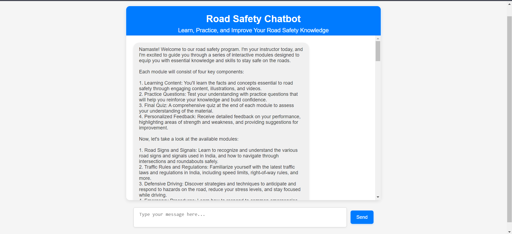

---

# 🚗 **AIRoadSafetyEduChatBot** 🚦

## ✨ **Overview**
**AIRoadSafetyEduChatBot** is an AI-powered, interactive educational chatbot designed to teach and reinforce road safety principles. By utilizing **React** for the frontend and **Node.js** for the backend, the chatbot delivers a personalized learning experience powered by **GroqAI API**, providing tailored content, adaptive questioning, and real-time performance feedback.

---

## 🌟 **Features**
- **🧠 AI-Powered Content Curation**: Dynamic learning content tailored to each learner’s progress.
- **🔄 Adaptive Questioning**: Difficulty of questions adjusts in real-time based on performance.
- **📊 Personalized Feedback**: Immediate insights into strengths and areas for improvement.
- **🔮 Performance Prediction**: AI model predicts learner success based on their engagement and progression.

---

## ⚙️ **Tech Stack**
- **Frontend**: React.js
- **Backend**: Node.js
- **API**: GroqAI API for intelligent content and assessment
- **Database**: (Optional, based on implementation)

---

## 🛠️ **Getting Started**

### **Prerequisites**
Before running the app, ensure you have:
- **Node.js** (version 12 or later)

### **Installation Steps**

1. **Clone the repository:**
   ```bash
   git clone https://github.com/Rijo-1/AIRoadSafetyEduChatBot.git
   ```
2. **Install dependencies:**
   - **Backend**:
     ```bash
     cd backend
     npm install
     ```
   - **Frontend**:
     ```bash
     cd frontend
     npm install
     ```

---

## 🚀 **Running the Application**

1. **Start the backend server**:
   ```bash
   cd backend
   npm start
   ```
2. **Start the frontend**:
   ```bash
   cd frontend
   npm start
   ```
3. Open your browser and go to `http://localhost:3000` to begin interacting with the chatbot!

---

## 📸 **Screenshots**
- 
- 

- 

---

## 🎥 **Demo Video**
Watch the project in action:  
[**Demo Video**](https://link_to_your_demo_video)

---

## 👥 **Contributors**
- [Mohith N](https://github.com/mohithn2004)
- [Sandeep Kumar S](https://github.com/sandyyman)

---

